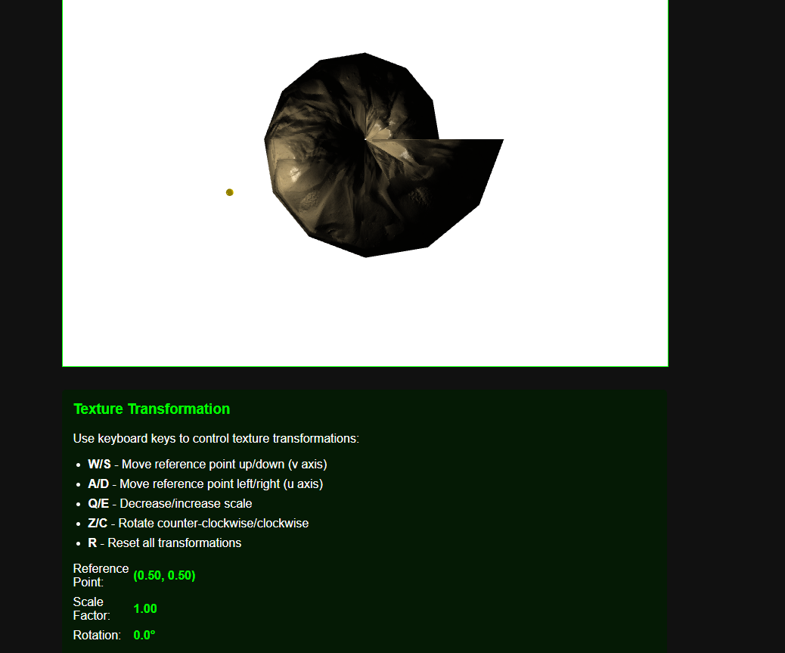
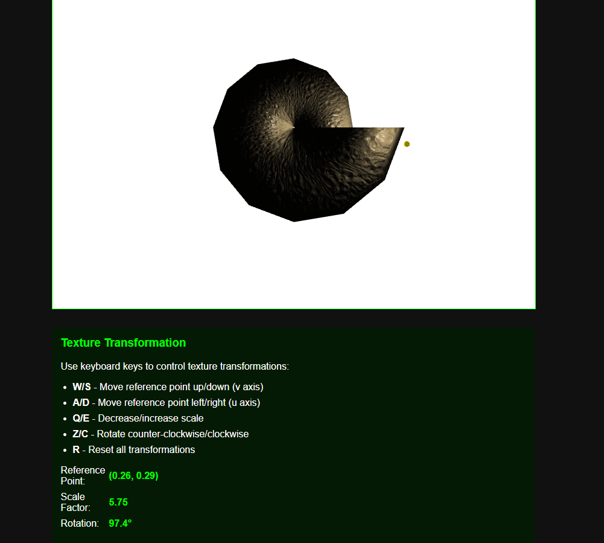

# WebGL Texture Transformation Project

## Cornucopia Surface with Dynamic Texture Mapping



---

# 1. Task Description

## Operations on Texture Coordinates

The task focuses on implementing advanced texture coordinate transformations in WebGL, specifically enabling dynamic manipulation of textures on a parametric surface. The primary objective is to scale or rotate a texture around a user-specified point within the UV space of the texture.

### Requirements

1. **Reuse existing functionality**: The implementation must reuse the texture mapping from the previous Control task as a foundation.

2. **Transformation implementation**: 
   - For odd-numbered variants: Implement texture scaling around a user-specified point
   - For even-numbered variants: Implement texture rotation around a user-specified point

3. **Interactive control**: Enable movement of the reference point within the texture's (u,v) space using keyboard controls:
   - **A and D keys**: Move the reference point along the u parameter (horizontal)
   - **W and S keys**: Move the reference point along the v parameter (vertical)

### Technical Focus

This task combines several important concepts in computer graphics:
- Texture coordinate manipulation
- Real-time user interaction
- Parametric surface rendering
- Shader-based transformations

The implementation should provide a seamless user experience that allows for dynamic visualization of how texture transformations affect the appearance of the 3D parametric surface.

---

# 2. Theoretical Background

## 2.1 Texture Mapping Fundamentals

Texture mapping is a technique in computer graphics that applies a 2D image (texture) to the surface of a 3D object. The process requires establishing a correspondence between points on the 3D model and locations within the 2D texture space.

### Texture Coordinates

A key concept in texture mapping is the texture coordinate system, typically denoted as (u,v) coordinates:
- The u-coordinate represents the horizontal position within the texture (0 at left, 1 at right)
- The v-coordinate represents the vertical position within the texture (0 at top, 1 at bottom)

For parametric surfaces like the Cornucopia model used in this project, there's a natural mapping between the surface parameters and the texture coordinates, allowing for precise control of texture placement.

### Texture Sampling

When rendering, the graphics pipeline performs texture sampling—the process of retrieving color values from a texture based on computed texture coordinates. The quality of this sampling is influenced by:

- **Filtering modes**: Techniques for interpolating between texture pixels
- **Mipmap levels**: Pre-computed downscaled versions of the texture for different viewing distances
- **Wrapping modes**: How textures behave outside the [0,1] coordinate range

## 2.2 Texture Transformations in UV Space

Transforming textures in UV space involves modifying the texture coordinates before they are used to sample the texture. Unlike transforming the 3D object itself, this approach changes only how the texture appears on the surface.

### Basic Transformations

The fundamental texture transformations include:
- **Translation**: Shifting the texture along the u or v axis
- **Scaling**: Expanding or contracting the texture
- **Rotation**: Rotating the texture around a specified point

### Transformation Mathematics

For operations like scaling and rotation around a specific point, we follow a three-step process:

1. **Translate to origin**: Move the reference point to the origin
   ```
   uv' = uv - reference_point
   ```

2. **Apply transformation**: Perform the scaling or rotation
   - For scaling:
   ```
   uv'' = uv' * scale_factor
   ```
   - For rotation by angle θ:
   ```
   uv'' = [cos(θ) -sin(θ); sin(θ) cos(θ)] * uv'
   ```

3. **Translate back**: Return the reference point to its original position
   ```
   uv''' = uv'' + reference_point
   ```

### GLSL Implementation

In WebGL, these transformations are most efficiently implemented within the vertex shader. The transformed texture coordinates are then interpolated across the triangle and used in the fragment shader for texture sampling.

## 2.3 Parametric Surface Texturing

The Cornucopia surface used in this project is defined by parametric equations, which creates a natural parameterization for texture mapping:

```
x(u,v) = [e^(mu) + e^(pu)cos(v)]cos(u)
y(u,v) = [e^(mu) + e^(pu)cos(v)]sin(u)
z(u,v) = e^(pu)sin(v)
```

This parametric nature allows us to directly map the surface parameters (u,v) to texture coordinates, creating a coherent texture mapping across the entire surface. The challenge lies in implementing transformations that respect this parameterization while providing intuitive controls for the user.

---

# 3. Implementation Details

## 3.1 Architecture Overview

The implementation follows a modular architecture with clear separation of concerns:



- **HTML/CSS**: Provides the user interface and canvas container
- **JavaScript**: Handles initialization, event handling, and scene management
- **WebGL**: Renders the 3D scene with shaders
- **GLSL Shaders**: Implements the core texture transformation logic

## 3.2 Shader Implementation

The texture transformation is implemented primarily in the vertex shader, where texture coordinates are modified before being passed to the fragment shader.

### Vertex Shader Transformation Function

```glsl
// Function to transform texture coordinates based on scaling/rotation
vec2 transformTexCoords(vec2 texCoords, vec2 refPoint, float scale, float angle) {
    // Translate to reference point origin
    vec2 centered = texCoords - refPoint;
    
    // Apply scale and rotation
    float s = sin(angle);
    float c = cos(angle);
    
    // Create rotation matrix
    mat2 rotation = mat2(
        c, -s,
        s, c
    );
    
    // Apply scale or rotation based on variant
    vec2 transformed;
    
    #ifdef ENABLE_ROTATION
        // Apply rotation around reference point
        transformed = rotation * centered;
    #else
        // Apply scaling around reference point
        transformed = centered * scale;
    #endif
    
    // Translate back from reference point
    return transformed + refPoint;
}
```

This function encapsulates the three-step transformation process described in the theory section:
1. Translate to origin by subtracting the reference point
2. Apply the appropriate transformation (scaling or rotation)
3. Translate back by adding the reference point

The preprocessing directive `#ifdef ENABLE_ROTATION` allows for conditional compilation based on the variant number, ensuring that odd variants implement scaling while even variants implement rotation.

## 3.3 Reference Point Movement

The reference point movement is managed through keyboard event listeners that update the global texture transformation variables:

```javascript
function setupKeyboardControls() {
    document.addEventListener('keydown', function(event) {
        let needRedraw = true;
        
        switch(event.key) {
            case 'a': case 'A': // Move reference point left (u-)
                texReferencePoint[0] -= texMoveSpeed;
                break;
                
            case 'd': case 'D': // Move reference point right (u+)
                texReferencePoint[0] += texMoveSpeed;
                break;
                
            case 'w': case 'W': // Move reference point up (v-)
                texReferencePoint[1] -= texMoveSpeed;
                break;
                
            case 's': case 'S': // Move reference point down (v+)
                texReferencePoint[1] += texMoveSpeed;
                break;
            
            // Additional controls for scaling and rotation
            // ...
            
            default:
                needRedraw = false;
                break;
        }
        
        // Ensure reference point stays in valid range
        texReferencePoint[0] = Math.max(0.0, Math.min(1.0, texReferencePoint[0]));
        texReferencePoint[1] = Math.max(0.0, Math.min(1.0, texReferencePoint[1]));
        
        // Update UI display
        updateTextureControlsDisplay();
        
        if (needRedraw) {
            // Request a new frame to see the changes
            requestAnimationFrame(draw);
        }
    });
}
```

This implementation ensures that the reference point remains within the valid [0,1] texture coordinate range, and updates the UI to reflect the current values.

## 3.4 Variant Detection

To implement the variant-specific behavior (scaling for odd variants, rotation for even variants), the shader compilation process includes variant detection:

```javascript
function createProgram(gl, vertexShaderSource, fragmentShaderSource) {
    // Determine the variant number from the DOM
    let variantNumber = 23; // Default
    
    try {
        // Find variant number in student info section
        const studentInfo = document.querySelector(".student-info");
        if (studentInfo) {
            const strongElements = studentInfo.querySelectorAll("strong");
            
            for (let i = 0; i < strongElements.length; i++) {
                if (strongElements[i].textContent.includes("Variant")) {
                    const variantText = strongElements[i].parentElement.textContent;
                    const match = variantText.match(/Variant.*?(\d+)/);
                    if (match && match[1]) {
                        variantNumber = parseInt(match[1]);
                        console.log("Detected variant number:", variantNumber);
                        break;
                    }
                }
            }
        }
    } catch (e) {
        console.warn("Could not detect variant number, using default:", variantNumber);
    }
    
    // Determine whether to use rotation (even) or scaling (odd)
    const useRotation = variantNumber % 2 === 0;
    
    // Modify shader source with appropriate #define
    let modifiedVertexSource = vertexShaderSource;
    if (useRotation) {
        modifiedVertexSource = "#define ENABLE_ROTATION\n" + vertexShaderSource;
    }
    
    // Continue with shader compilation...
}
```

This approach allows the same codebase to handle both scaling and rotation variants without duplicating code.

---

# 4. User Instructions

## 4.1 Getting Started

To work with the texture transformation features, follow these steps:

1. **Open the application** in a compatible web browser (Chrome, Firefox, or Edge recommended)

2. **Observe the initial state** of the Cornucopia surface with the default texture mapping

3. **Note the Texture Transformation panel** directly below the rendering canvas, which displays the current transformation parameters

## 4.2 Keyboard Controls

The texture transformations are controlled entirely through the keyboard:

### Reference Point Movement
- **W key**: Move reference point up (decrease v coordinate)
- **S key**: Move reference point down (increase v coordinate)
- **A key**: Move reference point left (decrease u coordinate)
- **D key**: Move reference point right (increase u coordinate)

### Transformation Controls
- **Q key**: Decrease scale factor (scaling variant) 
- **E key**: Increase scale factor (scaling variant)
- **Z key**: Rotate counter-clockwise (rotation variant)
- **C key**: Rotate clockwise (rotation variant)

### Reset Control
- **R key**: Reset all transformation parameters to defaults

## 4.3 Observing Transformations

As you use the keyboard controls, observe how the texture appearance changes on the surface:

### Before and After Transformation

1. Before applying texture transformations:
   

2. After applying texture transformations:
   


## 4.4 Tips for Effective Use

- **Start with small movements** of the reference point to understand how it affects the transformation
- **Observe the parameter values** in the control panel to monitor your changes
- **Use the R key** to reset if the transformation becomes difficult to understand
- **Experiment with different locations** of the reference point to see how it affects the transformation's appearance

---

# 5. Source Code Samples

## 5.1 Vertex Shader with Texture Transformation

```glsl
// Vertex shader for Phong shading with normal mapping and texture transformation
attribute vec3 vertex;
attribute vec3 normal;
attribute vec3 tangent;
attribute vec3 bitangent;
attribute vec2 texCoord;

uniform mat4 ModelViewProjectionMatrix;
uniform mat4 ModelViewMatrix;
uniform mat3 NormalMatrix; // For transforming normals
uniform vec3 lightPosition; // In world space

// Texture transformation uniforms
uniform vec2 texReferencePoint; // Reference point for transformations (u,v)
uniform float texScaleFactor;   // Scale factor 
uniform float texRotationAngle; // Rotation angle in radians

varying vec3 fragNormal;
varying vec3 fragTangent;
varying vec3 fragBitangent;
varying vec3 fragPosition;
varying vec3 fragLightPosition;
varying vec2 fragTexCoord;

// Function to transform texture coordinates based on scaling/rotation
vec2 transformTexCoords(vec2 texCoords, vec2 refPoint, float scale, float angle) {
    // Translate to reference point origin
    vec2 centered = texCoords - refPoint;
    
    // Apply scale and rotation
    float s = sin(angle);
    float c = cos(angle);
    
    // Create rotation matrix
    mat2 rotation = mat2(
        c, -s,
        s, c
    );
    
    // Apply scale or rotation
    vec2 transformed;
    
    #ifdef ENABLE_ROTATION
        // Apply rotation around reference point
        transformed = rotation * centered;
    #else
        // Apply scaling around reference point
        transformed = centered * scale;
    #endif
    
    // Translate back from reference point
    return transformed + refPoint;
}

void main() {
    // Transform vertex to clip space
    gl_Position = ModelViewProjectionMatrix * vec4(vertex, 1.0);
    
    // Pass transformed normal to fragment shader
    fragNormal = normalize(NormalMatrix * (-normal));
    
    // Transform tangent and bitangent to view space
    fragTangent = normalize(NormalMatrix * tangent);
    fragBitangent = normalize(NormalMatrix * bitangent);
    
    // Pass vertex position in view space for lighting calculations
    fragPosition = vec3(ModelViewMatrix * vec4(vertex, 1.0));
    
    // Pass light position to fragment shader
    fragLightPosition = vec3(ModelViewMatrix * vec4(lightPosition, 1.0));
    
    // Apply texture transformation and pass texture coordinates to fragment shader
    fragTexCoord = transformTexCoords(texCoord, texReferencePoint, 
                                      texScaleFactor, texRotationAngle);
}
```

## 5.2 Keyboard Event Handler Implementation

```javascript
/**
 * Keyboard event handler for texture transformation controls
 */
function setupKeyboardControls() {
    document.addEventListener('keydown', function(event) {
        let needRedraw = true;
        
        switch(event.key) {
            // Reference point movement
            case 'a': case 'A': // Move reference point left (u-)
                texReferencePoint[0] -= texMoveSpeed;
                break;
                
            case 'd': case 'D': // Move reference point right (u+)
                texReferencePoint[0] += texMoveSpeed;
                break;
                
            case 'w': case 'W': // Move reference point up (v-)
                texReferencePoint[1] -= texMoveSpeed;
                break;
                
            case 's': case 'S': // Move reference point down (v+)
                texReferencePoint[1] += texMoveSpeed;
                break;
                
            // Scaling controls
            case 'q': case 'Q': // Decrease scale
                texScaleFactor = Math.max(0.1, texScaleFactor - 0.05);
                break;
                
            case 'e': case 'E': // Increase scale
                texScaleFactor += 0.05;
                break;
                
            // Rotation controls
            case 'z': case 'Z': // Rotate counter-clockwise
                texRotationAngle -= 0.05;
                break;
                
            case 'c': case 'C': // Rotate clockwise
                texRotationAngle += 0.05;
                break;
                
            // Reset
            case 'r': case 'R': // Reset transformations
                texReferencePoint = [0.5, 0.5];
                texScaleFactor = 1.0;
                texRotationAngle = 0.0;
                break;
                
            default:
                needRedraw = false;
                break;
        }
        
        // Ensure reference point stays in reasonable bounds
        texReferencePoint[0] = Math.max(0.0, Math.min(1.0, texReferencePoint[0]));
        texReferencePoint[1] = Math.max(0.0, Math.min(1.0, texReferencePoint[1]));
        
        // Update UI to display current values
        updateTextureControlsDisplay();
        
        if (needRedraw) {
            // Redraw the scene with updated values
            requestAnimationFrame(draw);
        }
    });
}

/**
 * Update the display of texture control values
 */
function updateTextureControlsDisplay() {
    // Update UI elements showing current texture control values
    const refPointElem = document.getElementById('tex-ref-point-value');
    const scaleElem = document.getElementById('tex-scale-value');
    const rotationElem = document.getElementById('tex-rotation-value');
    
    if (refPointElem) {
        refPointElem.textContent = `(${texReferencePoint[0].toFixed(2)}, ${texReferencePoint[1].toFixed(2)})`;
    }
    
    if (scaleElem) {
        scaleElem.textContent = texScaleFactor.toFixed(2);
    }
    
    if (rotationElem) {
        // Convert to degrees for display
        const degrees = (texRotationAngle * 180 / Math.PI).toFixed(1);
        rotationElem.textContent = `${degrees}°`;
    }
}
```

## 5.3 Draw Function with Texture Transformation Uniforms

```javascript
/**
 * Draw function
 * @param {number} timestamp - Current timestamp from requestAnimationFrame
 */
function draw(timestamp) {
    // Apply mesh updates if needed
    if (meshUpdateNeeded) {
        updateMeshFromSliders();
        meshUpdateNeeded = false;
    }
    
    gl.clearColor(1, 1, 1, 1);
    gl.clear(gl.COLOR_BUFFER_BIT | gl.DEPTH_BUFFER_BIT);
    
    // Set up viewport
    gl.viewport(0, 0, gl.canvas.width, gl.canvas.height);
    
    // Create transformation matrices
    const aspect = gl.canvas.width/gl.canvas.height;
    const projectionMatrix = m4.perspective(Math.PI/3, aspect, 1, 200);
    
    // Get user rotation from trackball
    let modelViewMatrix = spaceball.getViewMatrix();
    
    // Translate back to see the whole structure
    const moveBack = m4.translation(0, 0, -70);
    
    // Update light position for animation
    const lightPosition = updateLightPosition(timestamp);
    
    // Update light source object position
    lightSource.updatePosition(lightPosition);
    
    // Apply transformations
    modelViewMatrix = m4.multiply(moveBack, modelViewMatrix);
    
    // Calculate the combined model-view-projection matrix
    const mvpMatrix = m4.multiply(projectionMatrix, modelViewMatrix);
    
    // Calculate normal matrix
    const normalMatrix = calculateNormalMatrix(modelViewMatrix, new Float32Array(9));
    
    // Set shader uniforms
    gl.uniformMatrix4fv(shProgram.iModelViewProjectionMatrix, false, mvpMatrix);
    gl.uniformMatrix4fv(shProgram.iModelViewMatrix, false, modelViewMatrix);
    gl.uniformMatrix3fv(shProgram.iNormalMatrix, false, normalMatrix);
    gl.uniform3fv(shProgram.iLightPosition, lightPosition);
    gl.uniform3fv(shProgram.iLightColor, [1.0, 1.0, 1.0]);
    
    // Pass texture transformation uniforms
    gl.uniform2fv(shProgram.iTexReferencePoint, texReferencePoint);
    gl.uniform1f(shProgram.iTexScaleFactor, texScaleFactor);
    gl.uniform1f(shProgram.iTexRotationAngle, texRotationAngle);
    
    // Draw the surface model
    surface.draw(shProgram);
    
    // Draw the light source
    lightSource.draw(shProgram, modelViewMatrix, projectionMatrix);
    
    // Request next frame for animation
    requestAnimationFrame(draw);
}
```

## 5.4 Variant Detection and Shader Compilation

```javascript
/**
 * Create shader program
 */
function createProgram(gl, vertexShaderSource, fragmentShaderSource) {
    // Determine the variant number
    let variantNumber = 23; // Default to 23
    
    try {
        // Find all strong elements in the student info section
        const studentInfo = document.querySelector(".student-info");
        if (studentInfo) {
            const strongElements = studentInfo.querySelectorAll("strong");
            
            // Find the one that contains "Variant"
            for (let i = 0; i < strongElements.length; i++) {
                if (strongElements[i].textContent.includes("Variant")) {
                    // Extract the variant number using regex
                    const variantText = strongElements[i].parentElement.textContent;
                    const match = variantText.match(/Variant.*?(\d+)/);
                    if (match && match[1]) {
                        variantNumber = parseInt(match[1]);
                        console.log("Detected variant number:", variantNumber);
                        break;
                    }
                }
            }
        }
    } catch (e) {
        console.warn("Could not detect variant number, using default:", variantNumber);
    }
    
    // Check if we should use rotation (even variant) or scaling (odd variant)
    const useRotation = variantNumber % 2 === 0;
    console.log("Using " + (useRotation ? "ROTATION" : "SCALING") + 
                " for texture transformation (variant " + variantNumber + ")");
    
    // Modify the shader source to include the appropriate #define
    let modifiedVertexSource = vertexShaderSource;
    if (useRotation) {
        modifiedVertexSource = "#define ENABLE_ROTATION\n" + vertexShaderSource;
    }
    
    // Create and compile vertex shader
    let vsh = gl.createShader(gl.VERTEX_SHADER);
    gl.shaderSource(vsh, modifiedVertexSource);
    gl.compileShader(vsh);
    if (!gl.getShaderParameter(vsh, gl.COMPILE_STATUS)) {
        throw new Error("Error in vertex shader: " + gl.getShaderInfoLog(vsh));
    }
    
    // Create and compile fragment shader
    let fsh = gl.createShader(gl.FRAGMENT_SHADER);
    gl.shaderSource(fsh, fragmentShaderSource);
    gl.compileShader(fsh);
    if (!gl.getShaderParameter(fsh, gl.COMPILE_STATUS)) {
        throw new Error("Error in fragment shader: " + gl.getShaderInfoLog(fsh));
    }
    
    // Create program and link shaders
    let prog = gl.createProgram();
    gl.attachShader(prog, vsh);
    gl.attachShader(prog, fsh);
    gl.linkProgram(prog);
    if (!gl.getProgramParameter(prog, gl.LINK_STATUS)) {
        throw new Error("Link error in program: " + gl.getProgramInfoLog(prog));
    }
    
    return prog;
}
```

This completes the source code section, providing key examples from the implementation that highlight the texture transformation functionality.