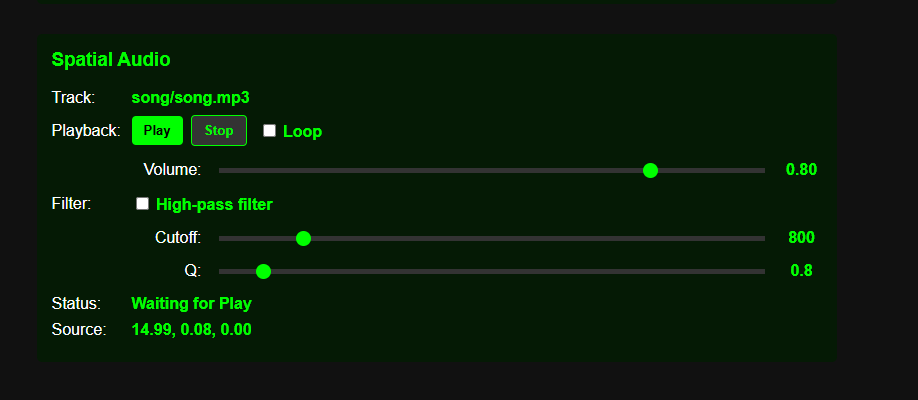
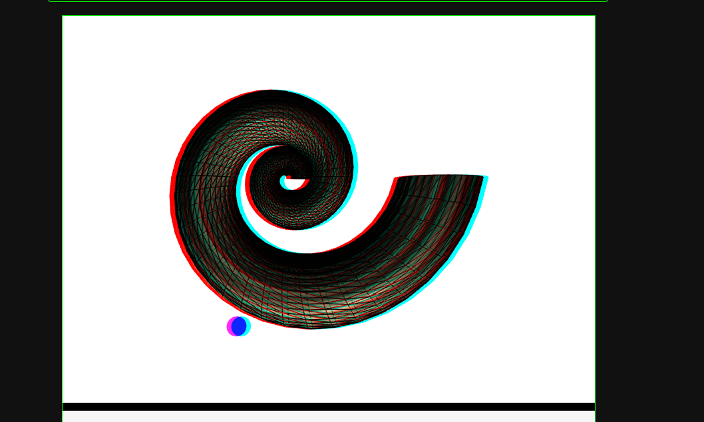

# Spatial Audio Control with Tangible Interface in WebGL and WebAudio

## Title Page

**Student:** Pashchenko Mykola  
**Group:** TR-51mp  
**Course:** Methods of Synthesis of Virtual Reality  
**Work:** Calculation and Graphics Work  
**Topic:** Spatial Audio  
**Variant:** 22  
**Variant Filter:** High-pass filter  
**Technologies:** WebGL, JavaScript, HTML5 WebAudio API, Android SensorServer

---

## 1. Task Description

The purpose of this calculation and graphics work is to implement spatial audio in a WebGL application using the HTML5 WebAudio API. The project reuses the previous practical assignment with the tangible interface and extends it with audio playback, positional sound, sound source visualization, and a variant-specific audio filter.

According to the assignment, the surface from the previous project must remain in the scene, but the tangible interface is used differently. In PA2, the Android phone controlled the orientation of the rendered surface. In this work, the surface stays still with respect to the phone input, and the phone controls the position of a sound source. The sound source moves around the geometrical center of the surface patch.

The audio source for this project is the local file:

```text
song/song.mp3
```

The sound is reproduced through WebAudio. Its spatial position is controlled by the user through the Android tangible interface and is visualized in the WebGL scene as a blue sphere. This makes it possible to both hear and see the position of the audio source.

For variant 22, the required audio filter is a high-pass filter. The implementation uses `BiquadFilterNode` with `type = "highpass"`. A checkbox in the user interface enables or disables this filter, and sliders allow changing the cutoff frequency and Q value.

The main functional requirements are:

- reuse the PA2 WebGL and tangible-interface code;
- implement spatial audio through the WebAudio API;
- play `song/song.mp3`;
- keep the surface visible in the scene;
- move the sound source around the surface center;
- visualize the sound source with a sphere;
- use phone sensor values from Android SensorServer to control sound source movement;
- add a high-pass filter for variant 22;
- provide controls for playback, volume, filter state, cutoff frequency, and Q.

---

## 2. Theoretical Background

Spatial audio is an audio rendering technique where sound is perceived as coming from a specific position in space. Instead of playing a sound equally in both stereo channels, the system calculates how the sound should be heard depending on the virtual position of the source and the listener. This allows the user to perceive direction and distance.

In the WebAudio API, audio processing is organized as a graph. Each node performs a specific operation. A source node produces sound, processing nodes modify it, and the final destination node sends it to the speakers or headphones.

The main WebAudio objects used in this project are:

- `AudioContext`: the central object that manages audio processing;
- `MediaElementAudioSourceNode`: connects an HTML `<audio>` element to the WebAudio graph;
- `GainNode`: controls the sound volume;
- `BiquadFilterNode`: applies an audio filter;
- `PannerNode`: places the sound source in 3D space;
- `AudioDestinationNode`: represents the final output device.

The audio graph in this implementation has two possible forms. When the high-pass filter is disabled, the graph is:

```text
audio element -> gain -> panner -> destination
```

When the high-pass filter is enabled, the graph is:

```text
audio element -> gain -> high-pass filter -> panner -> destination
```

The `PannerNode` is responsible for spatialization. It receives the 3D coordinates of the sound source and computes how the sound should be heard by the listener. In this work, the panner uses the `HRTF` panning model and the `inverse` distance model. HRTF gives a more realistic perception of direction, while inverse distance attenuation reduces the sound level as the source moves farther from the listener.

The listener is fixed near the camera position and oriented toward the scene. The sound source moves around the geometrical center of the surface. This produces the effect of the audio moving around the virtual object.

The high-pass filter required by variant 22 removes or attenuates low-frequency components of the signal. Frequencies above the cutoff frequency pass through more freely. This kind of filter can make the sound brighter and reduce bass. In WebAudio, the filter is configured as:

```javascript
audioFilterNode.type = "highpass";
audioFilterNode.frequency.value = 800;
audioFilterNode.Q.value = 0.8;
```

The tangible interface is based on Android sensor data received through SensorServer. The phone sends orientation values through a WebSocket connection. These values are used to calculate the sound source position. The azimuth controls the horizontal angle of the sound source around the surface center, while pitch influences its vertical movement.

---

## 3. Implementation Details

The project is implemented in HTML and JavaScript using WebGL and WebAudio. The main files are:

- `index.html`: contains the canvas and user interface panels;
- `cornucopia3.js`: contains the WebGL scene, PA2 sensor handling, spatial audio graph, and sound source movement;
- `shaders.js`: contains shader programs used for surface rendering and simple colored objects;
- `song/song.mp3`: the local audio file used as the sound source.

The user interface includes a separate **Spatial Audio** panel. This panel displays the current track name and provides controls for audio playback. It contains Play and Stop buttons, a Loop checkbox, a volume slider, a high-pass filter checkbox, and sliders for cutoff frequency and Q.

The HTML audio element is hidden because playback is controlled through the custom interface:

```html
<audio id="spatial-audio" src="./song/song.mp3" preload="auto" crossorigin="anonymous" style="display:none;"></audio>
```

Audio initialization happens only after the user presses Play. This is necessary because modern browsers require a user gesture before audio playback can start. The code creates an `AudioContext`, connects the hidden audio element to the audio graph, and configures the panner and filter nodes.

The high-pass filter is implemented with `BiquadFilterNode`. The filter is always created, but the graph is reconnected depending on whether the checkbox is enabled. When disabled, the audio bypasses the filter. When enabled, the signal passes through the high-pass filter before reaching the panner.

The sound source position is updated continuously in the render loop. If phone control is enabled, the position is calculated from the Android orientation values. If phone control is disabled, a fallback automatic orbit is used, which allows testing the spatial audio behavior even without a connected phone.

The current formula is:

```javascript
soundSourcePosition = [
    center[0] + Math.cos(azimuth) * soundOrbitRadius,
    center[1] + Math.sin(azimuth) * soundOrbitRadius,
    center[2] + Math.sin(pitch) * 5
];
```

After calculating the position, the same coordinates are sent to the `PannerNode` and to the WebGL sound source sphere. This keeps the visual and audio representations synchronized.

The sound source is shown as a blue sphere. It is rendered in the object stereo view using a simple solid-color shader. The sphere moves around the surface center and indicates the current spatial position of the audio.

The PA2 tangible interface remains available. The Android SensorServer connection is controlled from the Tangible Interface panel. For this work, phone orientation no longer rotates the surface. Instead, the checkbox enables phone control of the sound source. The model can still be inspected using mouse trackball rotation.

---

## 4. User Instructions

### 4.1 Start The Local Server

Open PowerShell in the project directory:

```powershell
cd "D:\PROJECT_ME\project_SHAME\INSTITUTKA\Semester_1\Visualisation\WebGL2"
```

Start the server:

```powershell
python -m http.server 8000 --bind 0.0.0.0
```

Open the application in a browser:

```text
http://127.0.0.1:8000/index.html
```

### 4.2 Prepare The Audio File

Make sure the audio file exists at:

```text
song/song.mp3
```

If the file is missing, the Spatial Audio panel will show that the track cannot be loaded.

### 4.3 Use Spatial Audio Controls

1. Open the page.
2. Find the **Spatial Audio** panel.
3. Press **Play** to initialize WebAudio and start playback.
4. Use the **Volume** slider to adjust loudness.
5. Enable **High-pass filter** to apply the variant 22 filter.
6. Adjust **Cutoff** to change which low frequencies are removed.
7. Adjust **Q** to change the resonance of the filter.
8. Press **Stop** to stop playback and reset the track.

### 4.4 Connect Android SensorServer

1. Start SensorServer on the Android phone.
2. Make sure the phone and computer are on the same network.
3. Copy the phone IP address and port from SensorServer.
4. In the **Tangible Interface** panel, enter a URL similar to:

```text
ws://192.168.0.103:8080/sensor/connect?type=android.sensor.orientation
```

5. Press **Connect**.
6. When sensor values begin updating, enable **Sound source control**.
7. Move the phone. The blue sphere and the spatial audio position should move around the surface.

### 4.5 Screenshots

The following screenshots should be inserted here after they are prepared:





---

## 5. Source Code Sample

### 5.1 Orientation Data Conversion

The Android orientation sensor values are converted into a rotation matrix in `ZXY` order. This is reused from PA2:

```javascript
function orientationAnglesToMatrix(values) {
    const z = values[0] * Math.PI / 180;
    const x = values[1] * Math.PI / 180;
    const y = values[2] * Math.PI / 180;

    const rz = m4.zRotation(z);
    const rx = m4.xRotation(x);
    const ry = m4.yRotation(y);

    return m4.multiply(ry, m4.multiply(rx, rz));
}
```

### 5.2 WebAudio Graph Connection

The audio graph is reconnected depending on whether the high-pass filter is enabled:

```javascript
function connectAudioGraph() {
    if (!audioSourceNode || !audioGainNode || !audioFilterNode || !audioPannerNode || !audioContext) return;

    audioSourceNode.disconnect();
    audioGainNode.disconnect();
    audioFilterNode.disconnect();
    audioPannerNode.disconnect();

    audioSourceNode.connect(audioGainNode);
    if (audioFilterEnabled) {
        audioGainNode.connect(audioFilterNode);
        audioFilterNode.connect(audioPannerNode);
    } else {
        audioGainNode.connect(audioPannerNode);
    }
    audioPannerNode.connect(audioContext.destination);
}
```

### 5.3 Spatial Audio Initialization

The WebAudio nodes are created after user interaction:

```javascript
function initializeSpatialAudio() {
    if (audioGraphInitialized) return true;

    spatialAudioElement = document.getElementById("spatial-audio");
    const AudioContextCtor = window.AudioContext || window.webkitAudioContext;

    audioContext = new AudioContextCtor();
    audioSourceNode = audioContext.createMediaElementSource(spatialAudioElement);
    audioGainNode = audioContext.createGain();
    audioFilterNode = audioContext.createBiquadFilter();
    audioPannerNode = audioContext.createPanner();

    audioFilterNode.type = "highpass";
    audioFilterNode.frequency.value = 800;
    audioFilterNode.Q.value = 0.8;

    audioPannerNode.panningModel = "HRTF";
    audioPannerNode.distanceModel = "inverse";
    audioPannerNode.refDistance = 1;
    audioPannerNode.maxDistance = 100;
    audioPannerNode.rolloffFactor = 1;

    connectAudioGraph();
    audioGraphInitialized = true;
    return true;
}
```

### 5.4 Sound Source Position

The sound source rotates around the surface center. Phone orientation controls the position when enabled:

```javascript
function updateSoundSourcePosition() {
    const center = surface && surface.center ? surface.center : [0, 0, 0];
    const fallbackAngle = performance.now() * 0.0004;
    const azimuth = phoneOrientationEnabled ? latestSensorValues[0] * Math.PI / 180 : fallbackAngle;
    const pitch = phoneOrientationEnabled ? latestSensorValues[1] * Math.PI / 180 : 0;

    soundSourcePosition = [
        center[0] + Math.cos(azimuth) * soundOrbitRadius,
        center[1] + Math.sin(azimuth) * soundOrbitRadius,
        center[2] + Math.sin(pitch) * 5
    ];

    if (soundSourceModel) {
        soundSourceModel.updatePosition(soundSourcePosition);
    }
    updatePannerPosition(soundSourcePosition);
    setAudioSourcePositionText(soundSourcePosition);
}
```

### 5.5 Drawing The Sound Source Sphere

The sound source is drawn as a blue sphere after the surface:

```javascript
function drawObjectStereoEye(viewport, isLeftEye, stereoCamera, colorMask, lightPosition) {
    gl.viewport(viewport.x, viewport.y, viewport.width, viewport.height);
    gl.scissor(viewport.x, viewport.y, viewport.width, viewport.height);
    gl.colorMask(colorMask[0], colorMask[1], colorMask[2], colorMask[3]);

    const projectionMatrix = isLeftEye ? stereoCamera.leftProjectionMatrix : stereoCamera.rightProjectionMatrix;
    const modelViewMatrix = buildModelViewMatrix(isLeftEye, stereoCamera);
    drawSurfacePass(modelViewMatrix, projectionMatrix, lightPosition);

    if (soundSourceModel) {
        soundSourceModel.drawSolid(lineProgram, modelViewMatrix, projectionMatrix, [0.05, 0.15, 1.0, 1.0]);
    }
}
```

---

## Conclusion

This calculation and graphics work extends the WebGL tangible-interface project with spatial audio. The sound file `song/song.mp3` is played through a WebAudio graph, positioned in 3D space with `PannerNode`, and filtered with a variant-specific high-pass `BiquadFilterNode`. The sound source is visualized by a sphere that moves around the surface center. Android SensorServer data can control this source position, creating a tangible interaction between a physical phone and the virtual spatial-audio scene.
